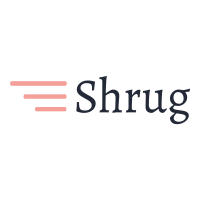

# Shrug.site

Shrug is a fast & open source link shortner writen with Golang and React.JS. For demo check [shrug.site](https://shrug.site)

## Installation

Copy `.env.example` to `.env` fill dbs credentials

And fill `GOOGLE_CLIENT_ID` from [console.developers.google.com/apis/credentials](https://console.developers.google.com/apis/credentials)

Also you need download `IP2LOCATION-LITE-DB11.BIN` and copy it in `server/files/` directory; The database will be updated in monthly basis for the greater accuracy. Free LITE databases are available at https://lite.ip2location.com/ upon registration

### Docker
By `docker-compose up -d` the project will be up on port `8000` which you can change it on `docker-compose.yml`.

### Screenshots

## Contributing
You can fork the repository, improve or fix some part of it and then send a pull requests. Or simply open and issue if there's a bug or you have a feature in mind.

## License

This software is released under the [MIT](https://github.com/TheYahya/shrug/blob/master/LICENSE) License.
