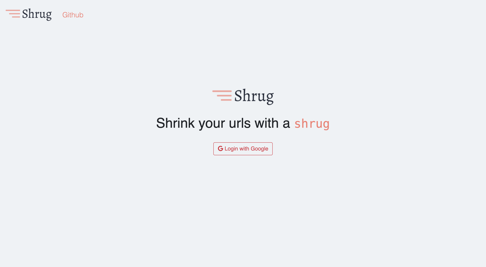

# Shrug

Shrug is a fast & open source link shortner writen with Golang and React.JS. For demo check [shrug.ir](http://shrug.ir)

## Installation

Copy `.env.example` to `.env` fill dbs credentials

### Develpment
Then with `make run-server` & `make run-client` you can run server & client.

### Deployment
By `docker-compose up -d` the project will be up on port `80` which you can change it on `docker-compose.yml`.

### Screnshots

 

## License

This software is released under the [MIT](https://github.com/TheYahya/shrug/blob/master/LICENSE) License.
